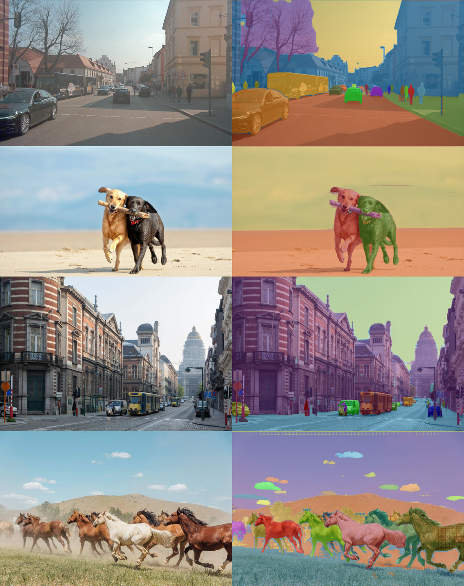
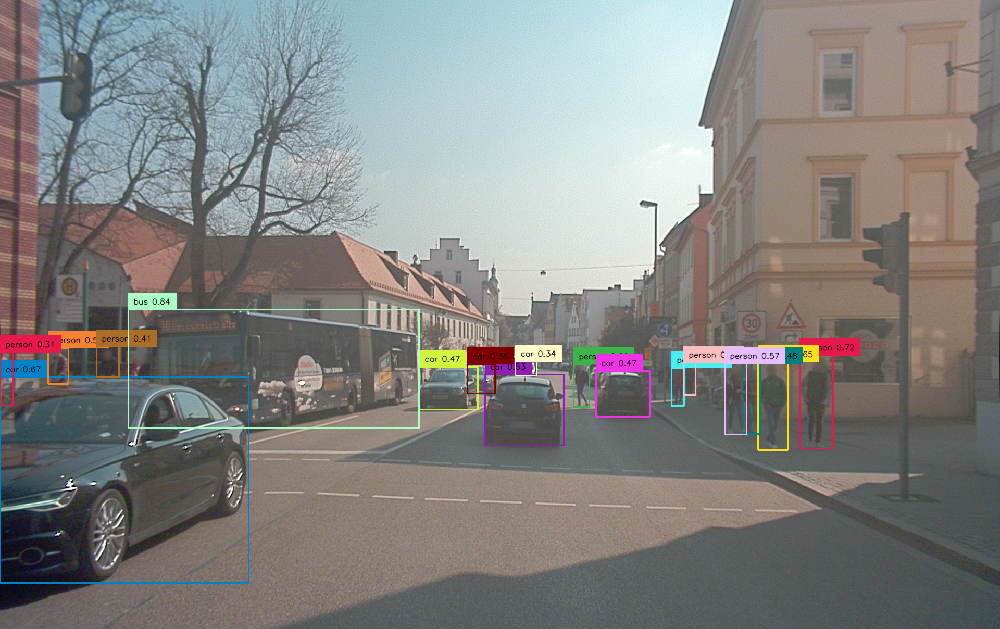
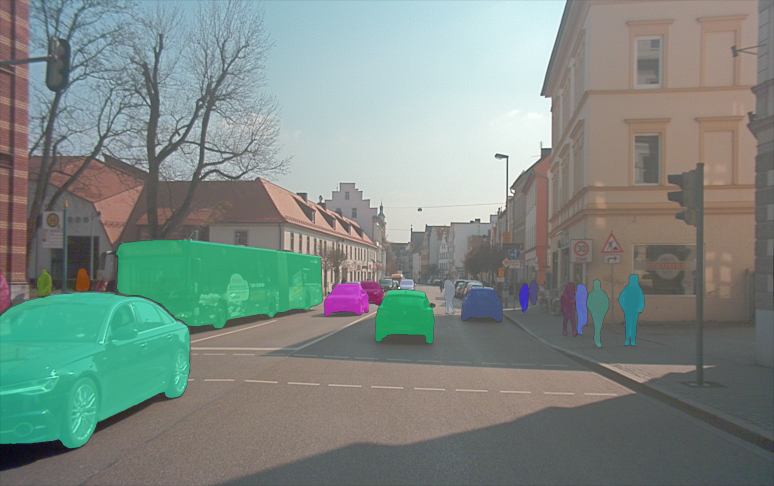
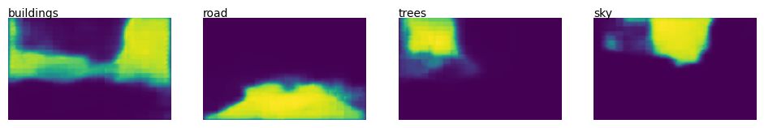
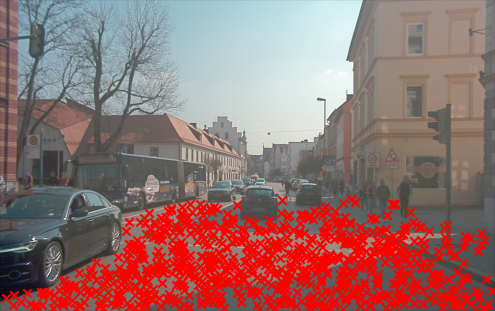
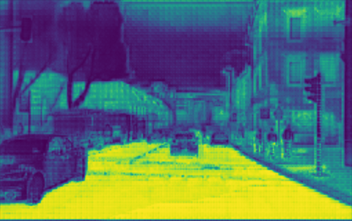
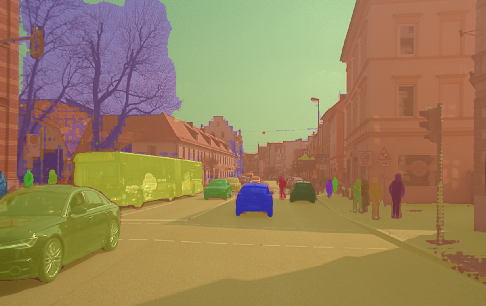

# Zero-shot panoptic segmentation using SAM

This is a proof of concept for zero-shot panoptic segmentation using the [Segment Anything Model (SAM)](https://github.com/facebookresearch/segment-anything). 

SAM cannot immediately achieve panoptic segmentation due to two limitations:
- The released version of SAM is not text-aware
- The authors of Segment Anything mention that it is unclear how to design simple prompts that implement semantic and panoptic segmentation

To solve these challenges we use the following additional models:
- [Grounding DINO](https://github.com/IDEA-Research/GroundingDINO), a zero-shot object detector
- [CLIPSeg](https://github.com/timojl/clipseg), a zero-shot (binary) segmentation model

You can try out the pipeline by running the [notebook in Colab](https://colab.research.google.com/github/segments-ai/panoptic-segment-anything/blob/master/panoptic-segment-anything.ipynb) or by trying out the [Gradio demo on Hugging Face Spaces](https://huggingface.co/spaces/segments/panoptic-segment-anything).

The notebook also shows how the predictions from this pipeline can be uploaded to [Segments.ai](https://segments.ai/) as pre-labels, where you can adjust them to obtain perfect labels for fine-tuning your segmentation model.

## 🖼️Results

## 🏗️ Pipeline
Our Frankenstein-ish pipeline looks as follows:

1. Use Grounding DINO to detect the "thing" categories (categories with instances)

2. Get instance segmentation masks for the detected boxes using SAM

3. Use CLIPSeg to obtain rough segmentation masks of the "stuff" categories

4. Sample points in these rough segmentation masks and feed these to SAM to get fine segmentation masks

5. Combine the background "stuff" masks with the foreground "thing" masks to obtain a panoptic segmentation label

## 💘 Acknowledgements
- Steps 1. and 2. are the same as [Grounded-Segment-Anything](https://github.com/IDEA-Research/Grounded-Segment-Anything). We also used their notebooks as a starting point.
- [Segment Anything](https://github.com/facebookresearch/segment-anything)
- [Grounding DINO](https://github.com/IDEA-Research/GroundingDINO)
- [CLIPSeg](https://github.com/timojl/clipseg) (see [our blog post on Hugging Face](https://huggingface.co/blog/clipseg-zero-shot) for more information)
- [yizhangliu/Grounded-Segment-Anything on Hugging Face Spaces](https://huggingface.co/spaces/yizhangliu/Grounded-Segment-Anything)
